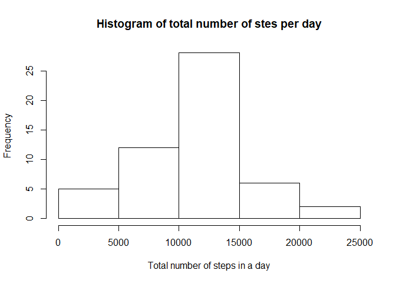
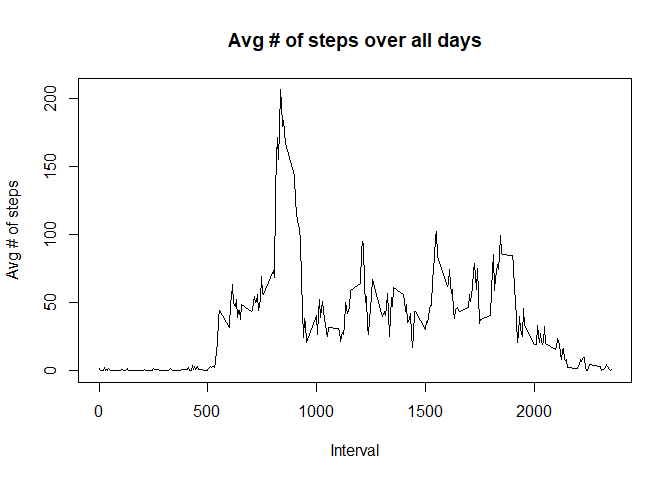
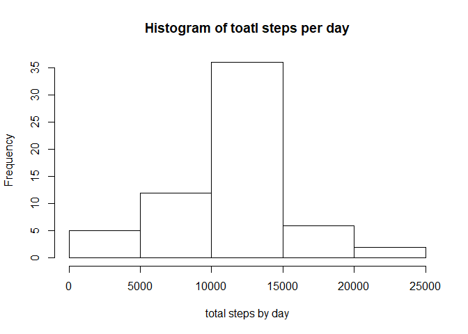
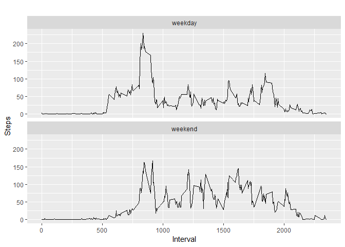

## Loading and preprocessing the data

```r
library(knitr)
```

```
## Warning: package 'knitr' was built under R version 3.3.3
```

```r
library(dplyr)
```

```
## 
## Attaching package: 'dplyr'
```

```
## The following objects are masked from 'package:stats':
## 
##     filter, lag
```

```
## The following objects are masked from 'package:base':
## 
##     intersect, setdiff, setequal, union
```

```r
library(ggplot2)
```

1. Load the Data

2. Process/transform the data

```r
data <- read.csv("activity.csv")#load
head(data)
```

```
##   steps       date interval
## 1    NA 2012-10-01        0
## 2    NA 2012-10-01        5
## 3    NA 2012-10-01       10
## 4    NA 2012-10-01       15
## 5    NA 2012-10-01       20
## 6    NA 2012-10-01       25
```

```r
data_clean <- data[with(data, {!(is.na(steps))}),]
head(data_clean,20)
```

```
##     steps       date interval
## 289     0 2012-10-02        0
## 290     0 2012-10-02        5
## 291     0 2012-10-02       10
## 292     0 2012-10-02       15
## 293     0 2012-10-02       20
## 294     0 2012-10-02       25
## 295     0 2012-10-02       30
## 296     0 2012-10-02       35
## 297     0 2012-10-02       40
## 298     0 2012-10-02       45
## 299     0 2012-10-02       50
## 300     0 2012-10-02       55
## 301     0 2012-10-02      100
## 302     0 2012-10-02      105
## 303     0 2012-10-02      110
## 304     0 2012-10-02      115
## 305     0 2012-10-02      120
## 306     0 2012-10-02      125
## 307     0 2012-10-02      130
## 308     0 2012-10-02      135
```

## What is mean total number of steps taken per day?

1. Calculate the total number of steps taken per day.


```r
#Mean total steps per day?
per_day <- group_by(data_clean,date)
head(per_day)
```

```
## # A tibble: 6 x 3
## # Groups:   date [1]
##   steps date       interval
##   <int> <fct>         <int>
## 1     0 2012-10-02        0
## 2     0 2012-10-02        5
## 3     0 2012-10-02       10
## 4     0 2012-10-02       15
## 5     0 2012-10-02       20
## 6     0 2012-10-02       25
```

```r
steps_by_day <- summarise(per_day, total = sum(steps))
steps_by_day
```

```
## # A tibble: 53 x 2
##    date       total
##    <fct>      <int>
##  1 2012-10-02   126
##  2 2012-10-03 11352
##  3 2012-10-04 12116
##  4 2012-10-05 13294
##  5 2012-10-06 15420
##  6 2012-10-07 11015
##  7 2012-10-09 12811
##  8 2012-10-10  9900
##  9 2012-10-11 10304
## 10 2012-10-12 17382
## # ... with 43 more rows
```

2. Make a histogram of the total number of steps taken each day. 


```r
#histogram
hist(steps_by_day$total, main = "Histogram of total number of stes per day", xlab = "Total number of steps in a day")
```

<!-- -->

3. Calculate and report the mean and median of the total of steps taken per day.


```r
summary(steps_by_day) #Median is 10765 and Mean is 10766
```

```
##          date        total      
##  2012-10-02: 1   Min.   :   41  
##  2012-10-03: 1   1st Qu.: 8841  
##  2012-10-04: 1   Median :10765  
##  2012-10-05: 1   Mean   :10766  
##  2012-10-06: 1   3rd Qu.:13294  
##  2012-10-07: 1   Max.   :21194  
##  (Other)   :47
```

The mean is reported as 10766 and the median is reported to be 10765

## What is the average daily activity pattern?
1. Make a time series plot (i.e. type = "l") of the 5-minute interval (x-axis) and the average number of steps taken, averaged across all days (y-axis)


```r
##Make time series plot of the 5min interval(x-axis) and the avg number of steps taken, avg over all days

steps_interval <- aggregate(steps ~ interval, data, mean)

plot(steps_interval$interval, steps_interval$steps, type = "l",
     main = "Avg # of steps over all days", xlab = "Interval",
     ylab = "Avg # of steps")
```

<!-- -->

2. Which 5-minute interval, on average across all the days in the dataset, contains the maximum number of steps?


```r
##Which row has max steps?

max_steps<- steps_interval[which.max(steps_interval$steps),]
print(max_steps)
```

```
##     interval    steps
## 104      835 206.1698
```

The row with the max steps is row 104, interval 835 with 206.1698.


## Imputing missing values
1. Calculate and report the total number of missing values in the dataset (i.e. the total number of rows with NAs)


```r
## Total number of missing values in the dataset??
total_missing <- sum(is.na(data))
```

The total number of missing values is 2304. 

2. Devise a strategy for filling in all of the missing values in the dataset. The strategy does not need to be sophisticated. For example, you could use the mean/median for that day, or the mean for that 5-minute interval, etc.

The strategy I've selected to fill the missing values is using the mean for the 5-minute interval. 


```r
##Devise strategy of filling empty/missing values in the dataset

data_copy <- data
for (i in 1:nrow(data_copy)){
    if(is.na(data_copy$steps[i])){
        interval_value <- data_copy$interval[i]
        steps_value <- steps_interval[
            steps_interval$interval== interval_value,]
        data_copy$steps[i] <- steps_value$steps
    }
}
```

3. Create a new dataset that is equal to the original dataset but with the missing data filled in.


```r
##calculate total number of steps taken each day
df_copy_steps_day <- aggregate(steps~date, data_copy, sum)
head(df_copy_steps_day)
```

```
##         date    steps
## 1 2012-10-01 10766.19
## 2 2012-10-02   126.00
## 3 2012-10-03 11352.00
## 4 2012-10-04 12116.00
## 5 2012-10-05 13294.00
## 6 2012-10-06 15420.00
```

4. Make a histogram of the total number of steps taken each day and Calculate and report the mean and median total number of steps taken per day. Do these values differ from the estimates from the first part of the assignment? What is the impact of imputing missing data on the estimates of the total daily number of steps?


```r
hist(df_copy_steps_day$steps, main = "Histogram of toatl steps per day", xlab = "total steps by day")
```

<!-- -->

```r
##How does data differ from original calculations?
mean(df_copy_steps_day$steps)
```

```
## [1] 10766.19
```

```r
median(df_copy_steps_day$steps)
```

```
## [1] 10766.19
```

```r
mean(steps_by_day$total)
```

```
## [1] 10766.19
```

```r
median(steps_by_day$total)
```

```
## [1] 10765
```
The mean is the same while the median is slightly lower relatively. 

## Are there differences in activity patterns between weekdays and weekends?
1. Create a new factor variable in the dataset with two levels – “weekday” and “weekend” indicating whether a given date is a weekday or weekend day.


```r
data_copy['type_of_day'] <- weekdays(as.Date(data_copy$date))
data_copy$type_of_day[data_copy$type_of_day %in% c('Saturday','Sunday')] <- "weekend"
data_copy$type_of_day[data_copy$type_of_day != "weekend"] <- "weekday"
```

2. Make a panel plot containing a time series plot (i.e. type = “l”) of the 5-minute interval (x-axis) and the average number of steps taken, averaged across all weekday days or weekend days (y-axis). See the README file in the GitHub repository to see an example of what this plot should look like using simulated data.


```r
data_copy$type_of_day <- as.factor(data_copy$type_of_day)
df_copy_steps_interval <- aggregate(steps~interval + type_of_day, data_copy,mean)
qplot(interval, steps, data = df_copy_steps_interval, type = 'l',
      geom = c("line"), xlab = "Interval", ylab = "Steps", main = "") +
facet_wrap(~type_of_day,ncol = 1,nrow = 2)
```

```
## Warning: Ignoring unknown parameters: type
```

<!-- -->

